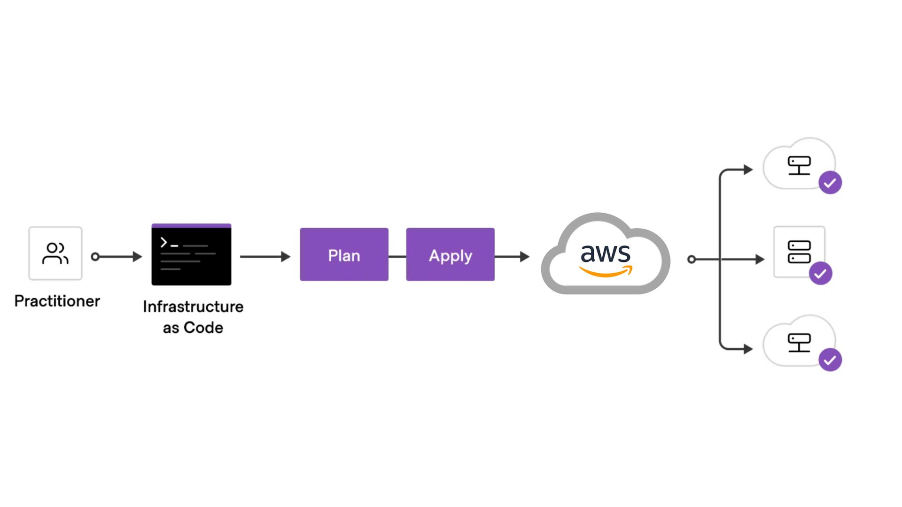

Auteur : Sid Ahmed Rabhi

Date : 06 janvier 2024

LinkedIn : https://www.linkedin.com/in/sid-ahmed-rabhi/

Portfolio : https://www.sid-rabhi.fr/

---

# Mini-projet Terraform (IaC)



# Introduction

Ce projet Terraform a pour but de déployer une application web sur AWS, en provisionnant une instance EC2 avec Ubuntu Lunar, un volume EBS, une adresse IP élastique EIP et un groupe de sécurité SG.

# Structure du Projet

Le projet est divisé en modules réutilisables pour faciliter la gestion et la maintenance de l'infrastructure :

- `modules/ebs`: Définit un volume EBS.
- `modules/ec2`: Configure une instance EC2 avec Ubuntu Lunar, installe nginx et utilise une clé SSH pour l'accès.
- `modules/eip`: Assigne une adresse IP élastique à l'instance EC2.
- `modules/sg`: Crée un groupe de sécurité qui autorise le trafic HTTP, HTTPS et SSH.
- `app`: Dossier contenant la configuration de l'application qui utilise les modules pour déployer l'instance EC2.

## Prérequis

- Terraform installé sur votre machine locale.
- Avoir un fichier contenant les identifiants AWS appropriés en respectant le bon format.
- Une clé SSH privé doit être disponible sur votre machine.

## Démarrage Rapide

1. Clonez ce dépôt sur votre machine locale.

    ```
    git clone https://github.com/sid-rabhi/mini-projet-terraform
    ```


2. Naviguez dans le dossier du projet (**app**) et initialisez Terraform avec la commande :


   ```sh
   terraform init
   ```

3. Visualiser votre infrastructure :


   ```sh
   terraform plan
   ```


4. Appliquez la configuration Terraform :


   ```sh
   terraform apply
   ```


5. Confirmez les actions proposées par Terraform lorsque vous y êtes invité.

## Configuration

Les variables par défaut sont définies dans les fichiers `variables.tf` de chaque module. Pour personnaliser ces variables, je les ai surchargé dans `app/main.tf` à l'appel des modules. Vous pouvez créez un fichier `terraform.tfvars` dans le dossier `app` ou passez des variables directement via la ligne de commande.

Exemple de contenu pour `app/terraform.tfvars` :

```hcl
instancetype = "t2.micro"
ebs_size = 10
sg_name = "app-sg"
```

## Outputs

Après l'exécution, Terraform affichera les ID des ressources créées, y compris l'ID de l'instance EC2 et le nom du groupe de sécurité. Vous trouverez également l'adresse IP publique de l'instance dans le fichier `app/ip_ec2.txt`.

## Nettoyage

Pour détruire l'infrastructure créée par Terraform (et éviter des frais supplémentaires), exécutez :

```sh
terraform destroy
```

## Sécurité

- Ne versionnez jamais vos clés privées ou vos fichiers d'état Terraform.
- Utilisez des politiques IAM restrictives pour contrôler l'accès aux ressources AWS.

## Conclusion

Ce mini projet Terraform m'a donné l'occasion de saisir le déploiement d'une infrastructure sur AWS de façon modulaire et reproductible. J'ai acquis une compréhension pratique de l'utilisation des modules Terraform pour définir divers aspects de l'infrastructure AWS, les reliant de manière cohérente pour former un environnement complet.
